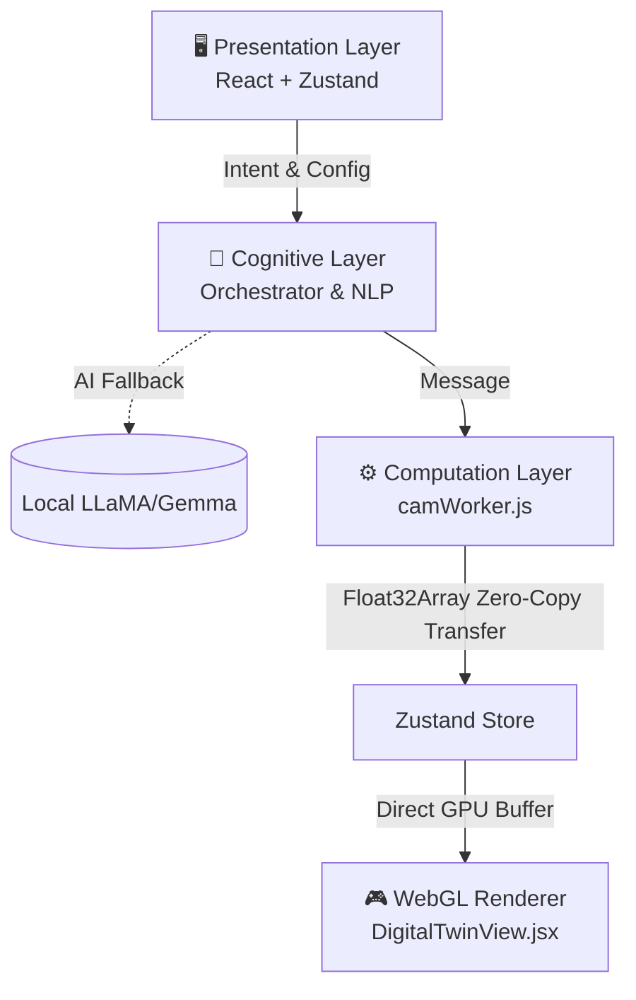

# 🏗️ RAKEEZ OS V3: Technical Whitepaper & Architecture Handover

## 1. Executive Summary & System Mission

**RAKEEZ OS V3** represents a monumental leap in Browser-Based Industrial Manufacturing. It has completely shifted from a React-bound UI prototyping tool into a high-performance, **Distributed Hybrid Architecture**. 

Its mission is to serve as an **industrial-grade, AI-driven, zero-footprint CNC controller**. Unlike traditional software (Siemens Sinumerik, Mach4, LinuxCNC) that requires heavy desktop installations, RAKEEZ OS runs directly in a client browser while achieving **native-level WebGL performance** (60 FPS rendering up to 500,000+ vertices) and maintaining rigorous mathematical determinism for critical machining operations ranging from standard 3-Axis milling to complex 4-Axis rotary turning.

The foundational design philosophy of V3 is: **Strict Separation of Concerns**. The UI thread never computes geometry; the computation thread never touches the DOM.

---

## 2. Core Architecture & Data Flow (The Blueprint)

RAKEEZ OS V3 implements a strict **3-Tier Distributed Architecture**, leveraging modern Web APIs to ensure the main thread never blocks.



### The 3-Tier Layer Breakdown

1. **Presentation Layer (UI):** Built with React, Tailwind CSS (Bento Box Zero-Scroll layout), and Zustand. Throttled data reads (e.g., DRO telemetry at 10Hz) prevent DOM trashing.
2. **Cognitive Layer:** The initial user intent is passed to either the `OllamaService` (leveraging a local, offline LLM) or the regex-driven deterministic fallback (`IntentParser.js`). The NLP translates Arabic workshop terminology ("امسح", "لوح", "سنة") to strict JSON.
3. **Computation Layer:** `CamOrchestrator.js` routes the JSON to the isolated `camWorker.js` background thread. The worker handles all complex calculus and trigonometry, bypassing string-heavy objects entirely in favor of an optimized `Float32Array` containing $X, Y, Z$ Cartesian matrices. Memory boundaries are crossed instantaneously using JavaScript's zero-copy `Transferable Objects`.

---

## 3. The Math Kernel (CAM Engine inside WebWorker)

The heart of the system resides in `camWorker.js`. Instead of generating G-code strings point-by-point (which crashes browsers via string allocation overhead), the kernel calculates spatial floats. Full G-code strings are generated *on-demand/lazily* when the user requests an export.

### 3.1. Zig-Zag Meander Facing
If `operation === 'FACE'` & `shape === 'RECTANGLE'`, the engine executes an industrial Facing pass.
- Starts completely clear of the stock (`0 - toolRadius`).
- Meanders across the full width, performing a strict `40% stepdown` (`toolDiameter * 0.4`) recursively until the total rectangle height is stripped of material.

### 3.2. Archimedean Spiral Pocketing
For circular pockets, the worker generates concentric outwards spirals.
$$ r(\theta) = \text{Stepover} \cdot \left( \frac{\theta}{2\pi} \right) $$
Points rotate iteratively outwards until intersecting the theoretical pocket radius constraint.

### 3.3. Involute Curve Gear Interpolation
For generating precise spur gears:
- Derives the Pitch, Base, Root, and Outer radii mathematically.
- Involute equation logic iteratively steps `phiMax` to trace geometrically perfect gear flanks.
$$ r(\phi) = \sqrt{\text{Base}_\text{radius}^2 \cdot (1 + \phi^2)} $$

### 3.4. The 4-Axis Kinematic Transformation
When `machineMode === '4-AXIS'` or a lathe operation is triggered, the worker translates Angular Coordinate space ($A$, measuring degrees of rotation) directly into the Cartesian ($X$, $Y$, $Z$) buffer expected by the WebGL Twin:
```javascript
// A is evaluated in radians
Visual_X = Z_longitudinal;
Visual_Y = X_depth * Math.cos(A_radians);
Visual_Z = X_depth * Math.sin(A_radians);
```
This forces the renderer to physically draw the spun cylinder naturally in Euclidean space while keeping the rendering engine blissfully unaware of the 4th axis kinematics.

---

## 4. Zero-Lag 3D Visualization (The WebGL Renderer)

In V2, React tried to mount thousands of `<line>` components, fatally crashing the application. V3 abandoned React-based points entirely in `DigitalTwinView.jsx`.

### The GPU-Direct Pathway
1. **Raw Array Injection:** The transferred `Float32Array` from the worker is attached directly to a single `THREE.BufferGeometry` using `setAttribute('position', ...)`.
2. **Time-Travel Simulation:** Rather than mutating arrays per frame to simulate movement, the buffer retains *all* points. RAKEEZ animates the machine by incrementing `geometry.setDrawRange(0, currentPointIndex)` inside a native `useFrame` loop. 
3. **Throttled Hooks:** The `CNC_Tool` visual tracks the absolute `actualPos`. During execution, Zustand coordinates are heavily throttled—preventing React cascading renders from blocking the 60 FPS WebGL loop.

---

## 5. Industrial Operations & Safety

### Dynamic Machine Configuration
`MachineSetup.jsx` allows the operator to define the physical world before calculation:
- **Envelope / Bed Size**: Absolute soft limits.
- **Stock Workpiece**: Volumetric physical dimensions (Width, Height, Depth).
- **Work Coordinate System (WCS)**: Shift operations natively to Center or Bottom-Left offsets.

### In-Flight Binary Auditing
Rather than iterating the data array a second time via an external `$O(N)$` loop in `SafetyAuditor.js`, safety rules were embedded straight into the `push()` injection loop inside the Worker.
- Continuously bounds checks `X`, `Y`, and `Z`.
- Evaluates `$O(1)$` conditions per vertex against custom Envelope arrays.
- Triggers strict `FEEDRATE` adaptation (dropping from RAPID 5000 to CUT 400 upon $Z$ coordinate negative plunging constraints).

---

## 6. Hardware Connectivity Readiness

RAKEEZ OS is architecturally prepared to eliminate intermediary Python/C++ backends usually required by standard g-code senders using the **WebSerial API**.

### Theoretical Direct-to-Microcontroller Bridge:
Because the system stores full pre-parsed binary sets and can lazily emit raw $G$-code text blocks:
1. The navigator can request a COM port native handshake using `navigator.serial.requestPort()`.
2. Streams can establish pipeline parity with an ESP32 running **FluidNC** or **GRBL HAL**.
3. RAKEEZ's existing simulation progress cursor (`currentPathIndex`) acts simultaneously as the hardware synchronization byte-stream tracker, awaiting an `ok` response from the controller before shifting the buffer indices iteratively. 
4. The system becomes a direct UI-to-Hardware embedded system.
